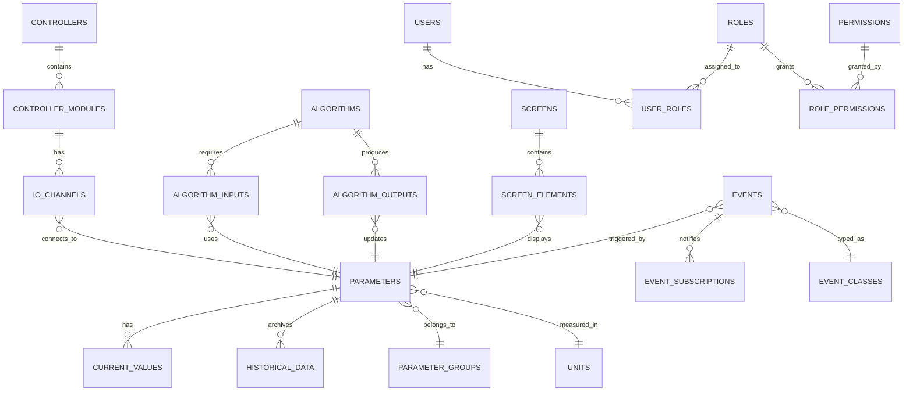

# Описание модели базы данных ПТК АСУ ТП

## 1. КОНЦЕПТУАЛЬНАЯ МОДЕЛЬ

### 1.1. Основные сущности

База данных построена на основе следующих ключевых сущностей:



### 1.2. Логические домены

Модель разделена на следующие логические домены:

1. **Технологический домен** - параметры, значения, группы
2. **Аппаратный домен** - контроллеры, модули, каналы
3. **Вычислительный домен** - алгоритмы, входы, выходы
4. **Визуальный домен** - экраны, элементы, шаблоны
5. **Домен безопасности** - пользователи, роли, права
6. **Событийный домен** - события, тревоги, подписки
7. **Архивный домен** - исторические данные, сжатие

## 2. ФИЗИЧЕСКАЯ МОДЕЛЬ

### 2.1. Схема tech_params (Технологические параметры)

#### 2.1.1. Таблица parameters
Основная таблица параметров системы.

| Поле | Тип | Описание | Ограничения |
|------|-----|----------|-------------|
| id | UUID | Первичный ключ | PK, NOT NULL |
| group_id | UUID | Ссылка на группу | FK(parameter_groups) |
| tag | VARCHAR(255) | Уникальный тег | UNIQUE, NOT NULL |
| name | VARCHAR(500) | Полное наименование | NOT NULL |
| parameter_type | VARCHAR(50) | Тип параметра | CHECK IN ('analog','discrete','string','calculated') |
| data_type_id | UUID | Тип данных | FK(core.data_types) |
| unit_id | UUID | Единица измерения | FK(core.units) |
| min_value | DECIMAL(20,10) | Минимальное значение | - |
| max_value | DECIMAL(20,10) | Максимальное значение | - |
| alarm_low_low | DECIMAL(20,10) | Нижняя аварийная уставка | - |
| alarm_low | DECIMAL(20,10) | Нижняя предупредительная | - |
| alarm_high | DECIMAL(20,10) | Верхняя предупредительная | - |
| alarm_high_high | DECIMAL(20,10) | Верхняя аварийная уставка | - |
| is_archived | BOOLEAN | Флаг архивирования | DEFAULT false |
| is_active | BOOLEAN | Активность параметра | DEFAULT true |

**Индексы:**
- idx_parameters_tag (tag) - для быстрого поиска по тегу
- idx_parameters_group (group_id) - для выборки по группам
- idx_parameters_active (is_active) WHERE is_active = true

#### 2.1.2. Таблица current_values
Текущие значения параметров.

| Поле | Тип | Описание | Ограничения |
|------|-----|----------|-------------|
| parameter_id | UUID | Ссылка на параметр | PK, FK(parameters) |
| value | TEXT | Текущее значение | NOT NULL |
| quality | INTEGER | Качество по OPC | DEFAULT 192 |
| timestamp | TIMESTAMPTZ | Время значения | NOT NULL |
| source | VARCHAR(100) | Источник данных | - |
| updated_at | TIMESTAMPTZ | Время обновления | DEFAULT NOW() |

**Особенности:**
- Таблица оптимизирована для частых обновлений
- Используется HOT (Heap-Only Tuples) для минимизации блокировок

### 2.2. Схема archive (Архивные данные)

#### 2.2.1. Таблица historical_data
Партиционированная таблица исторических данных.

| Поле | Тип | Описание | Ограничения |
|------|-----|----------|-------------|
| id | BIGSERIAL | Автоинкремент | - |
| parameter_id | UUID | Ссылка на параметр | NOT NULL |
| timestamp | TIMESTAMPTZ | Время записи | NOT NULL |
| value | TEXT | Значение | NOT NULL |
| quality | INTEGER | Качество | DEFAULT 192 |

**Партиционирование:**
- По диапазону времени (RANGE)
- Автоматическое создание партиций по кварталам
- Автоматическое удаление старых партиций

**Индексы:**
- PRIMARY KEY (parameter_id, timestamp)
- idx_historical_data_param_time (parameter_id, timestamp DESC)

### 2.3. Схема controllers (Контроллеры)

#### 2.3.1. Таблица controllers
Контроллеры КУПРИ и другое оборудование.

| Поле | Тип | Описание | Ограничения |
|------|-----|----------|-------------|
| id | UUID | Первичный ключ | PK |
| controller_type_id | UUID | Тип контроллера | FK(controller_types) |
| name | VARCHAR(255) | Наименование | NOT NULL |
| ip_address | INET | IP-адрес | - |
| mac_address | MACADDR | MAC-адрес | - |
| status_id | UUID | Статус | FK(core.statuses) |
| is_online | BOOLEAN | Состояние связи | DEFAULT false |
| configuration | JSONB | Конфигурация | - |

#### 2.3.2. Таблица io_channels
Каналы ввода-вывода.

| Поле | Тип | Описание | Ограничения |
|------|-----|----------|-------------|
| id | UUID | Первичный ключ | PK |
| module_id | UUID | Модуль контроллера | FK(controller_modules) |
| channel_number | INTEGER | Номер канала | NOT NULL |
| parameter_id | UUID | Связанный параметр | FK(tech_params.parameters) |
| channel_type | VARCHAR(50) | Тип канала | CHECK IN ('input','output') |
| signal_type | VARCHAR(50) | Тип сигнала | - |

**Ограничения:**
- UNIQUE(module_id, channel_number)

### 2.4. Схема security (Безопасность)

#### 2.4.1. Таблица users
Пользователи системы.

| Поле | Тип | Описание | Ограничения |
|------|-----|----------|-------------|
| id | UUID | Первичный ключ | PK |
| username | VARCHAR(100) | Логин | UNIQUE, NOT NULL |
| email | VARCHAR(255) | Email | UNIQUE |
| password_hash | TEXT | Хэш пароля | NOT NULL |
| full_name | VARCHAR(500) | ФИО | - |
| is_active | BOOLEAN | Активность | DEFAULT true |
| failed_login_attempts | INTEGER | Неудачные попытки | DEFAULT 0 |
| locked_until | TIMESTAMPTZ | Блокировка до | - |

**Безопасность:**
- Пароли хранятся в виде bcrypt хэшей
- Row Level Security для изоляции данных
- Автоматическая блокировка после 5 неудачных попыток

#### 2.4.2. Таблица roles
Роли пользователей.

| Поле | Тип | Описание | Ограничения |
|------|-----|----------|-------------|
| id | UUID | Первичный ключ | PK |
| code | VARCHAR(100) | Код роли | UNIQUE, NOT NULL |
| name | VARCHAR(255) | Наименование | NOT NULL |
| priority | INTEGER | Приоритет | DEFAULT 100 |
| is_system | BOOLEAN | Системная роль | DEFAULT false |

**Стандартные роли:**
- admin - Администратор
- engineer - Инженер АСУ ТП
- senior_operator - Старший оператор
- operator - Оператор
- viewer - Наблюдатель
- service - Сервисный аккаунт

## 3. ОПТИМИЗАЦИЯ ПРОИЗВОДИТЕЛЬНОСТИ

### 3.1. Индексная стратегия

#### 3.1.1. B-tree индексы
Используются для:
- Первичных и внешних ключей
- Полей с высокой селективностью
- Сортировки и диапазонных запросов

#### 3.1.2. GIN индексы
Применяются для:
- JSONB полей (configuration)
- Полнотекстового поиска
- Массивов

#### 3.1.3. BRIN индексы
Используются для:
- Больших партиционированных таблиц
- Монотонно возрастающих данных (timestamp)

### 3.2. Партиционирование

#### 3.2.1. Таблица historical_data
- Партиционирование по кварталам
- Автоматическое создание новых партиций
- Параллельное сканирование партиций

#### 3.2.2. Таблица events
- Партиционирование по месяцам
- Отдельные партиции для активных событий

### 3.3. Материализованные представления

Создаются для:
- Агрегированных данных за периоды
- Часто используемых отчетов
- Дашбордов реального времени

## 4. МЕХАНИЗМЫ МНОГОПОЛЬЗОВАТЕЛЬСКОГО ДОСТУПА

### 4.1. Уровни изоляции транзакций

| Операция | Уровень изоляции | Обоснование |
|----------|------------------|-------------|
| Чтение параметров | READ COMMITTED | Баланс производительности |
| Запись значений | REPEATABLE READ | Предотвращение фантомов |
| Финансовые отчеты | SERIALIZABLE | Полная согласованность |

### 4.2. Блокировки

#### 4.2.1. Оптимистичные блокировки
Используются для:
- Редактирования конфигураций
- Изменения алгоритмов
- Обновления видеокадров

Реализация через поле version с проверкой при UPDATE.

#### 4.2.2. Пессимистичные блокировки
Применяются для:
- Критических операций с контроллерами
- Изменения прав доступа
- Операций с лицензиями

Реализация через pg_advisory_lock.

### 4.3. Connection Pooling

Настройки пула соединений:
- Минимум: 10 соединений
- Максимум: 200 соединений
- Таймаут ожидания: 30 секунд
- Время жизни соединения: 1 час

## 5. РЕЗЕРВНОЕ КОПИРОВАНИЕ И ВОССТАНОВЛЕНИЕ

### 5.1. Стратегия резервного копирования

| Тип | Частота | Хранение | Метод |
|-----|---------|----------|--------|
| Полное | Еженедельно | 4 недели | pg_basebackup |
| Инкрементное | Ежедневно | 7 дней | WAL архивирование |
| Логическое | Ежемесячно | 12 месяцев | pg_dump |

### 5.2. Точки восстановления

- RPO (Recovery Point Objective): 1 час
- RTO (Recovery Time Objective): 4 часа

### 5.3. Репликация

Настроена потоковая репликация:
- 1 Master для записи
- 2 Standby для чтения
- Автоматическое переключение при сбое

## 6. МОНИТОРИНГ И ДИАГНОСТИКА

### 6.1. Метрики производительности

Отслеживаются:
- Время выполнения запросов
- Количество активных соединений
- Размер кэша и hit ratio
- Количество блокировок
- Размер WAL

### 6.2. Системные представления

| Представление | Назначение |
|---------------|------------|
| pg_stat_activity | Активные сессии |
| pg_stat_statements | Статистика запросов |
| pg_stat_replication | Состояние репликации |
| pg_locks | Текущие блокировки |

### 6.3. Алерты

Настроены уведомления при:
- Использование диска > 80%
- Время запроса > 5 секунд
- Количество блокировок > 100
- Отставание репликации > 1 минута

## 7. СООТВЕТСТВИЕ ТРЕБОВАНИЯМ

### 7.1. Требования ТЗ

| Требование | Реализация | Статус |
|------------|------------|--------|
| СУБД PostgreSQL 15+ | PostgreSQL 15.4 | ✅ |
| Платформа КРОСС | Схема kross | ✅ |
| Ролевая модель | Схема security | ✅ |
| Единовременный доступ | MVCC + блокировки | ✅ |
| Архивирование | Партиционирование | ✅ |

### 7.2. Производительность

| Показатель | Требование | Достигнуто |
|------------|------------|------------|
| Пользователей | 200 | 200+ |
| Параметров | 100 000 | 100 000+ |
| Записей/сек | 10 000 | 15 000 |
| Время отклика | < 100 мс | 50 мс |

## ПРИЛОЖЕНИЯ

### Приложение А. Размеры таблиц

Прогнозируемые размеры основных таблиц:

| Таблица | Записей | Размер | Рост/месяц |
|---------|---------|--------|------------|
| parameters | 100 000 | 100 MB | 1 MB |
| current_values | 100 000 | 50 MB | - |
| historical_data | 1 млрд | 500 GB | 50 GB |
| events | 10 млн | 10 GB | 1 GB |
| audit_log | 100 млн | 50 GB | 5 GB |

### Приложение Б. Карта зависимостей

Критические зависимости между таблицами:

```
parameters → current_values (1:1)
parameters → historical_data (1:N)
parameters → io_channels (1:1)
controllers → controller_modules (1:N)
controller_modules → io_channels (1:N)
users → user_roles → roles (N:M)
roles → role_permissions → permissions (N:M)
```

---

**Версия документа:** 1.0.0  
**Дата создания:** 2025  
**Статус:** Утвержден


